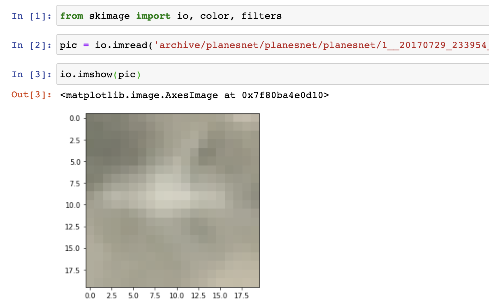

# Capstone 2 Proposal

## [Fake News](https://www.kaggle.com/anmolkumar/fake-news-content-detection?select=train.csv):
* Use TD-IDF to extract features from data
* Possibly use PCA to reduce dimensions
* Try out different models including ensemble methods, mlp, cnns, etc. to predict the label

## [Plane Data](https://www.kaggle.com/rhammell/planesnet):
I just realized that these pictures are very small (only 20x20). I tried to plot one and it was extremely pixely. Not sure if that makes this a bad data set or not.

* Read in and visualize data
* Base line model  - Random Forest using the original data
* Transform data using edge detection to train on as opposed to pixel intensity. Rerun random forest.
* Try MLP, CNN, and maybe xgboost

## [Dogs vs. Wolves](https://www.kaggle.com/harishvutukuri/dogs-vs-wolves)
* Classification
* Similar plan as above

